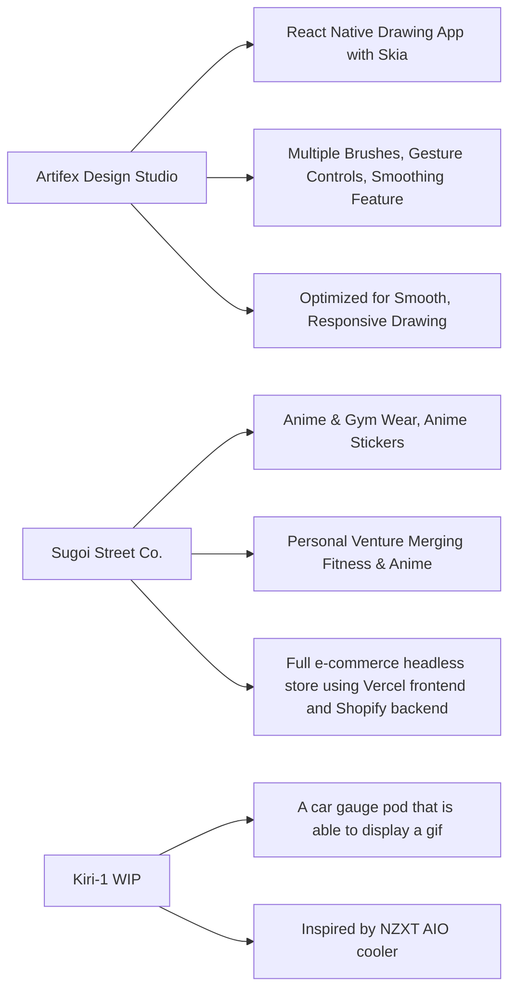

# Jesus' Portfolio

Welcome to my portfolio! I'm a full-stack developer, UX designer, and all-around tech enthusiast who loves to create, build, and optimize solutions. This space is a showcase of my projects, skills, and the work I've done in both development and design.

## About Me

I'm passionate about combining creative problem-solving with cutting-edge technology. Whether it's designing a sleek UI, optimizing backend systems, or exploring the world of AI-driven applications, I thrive on delivering high-quality, efficient, and user-friendly solutions. My journey has allowed me to work on everything from e-commerce sites to React Native apps, machine learning models, and more.

### Skills:
- **Languages**: JavaScript, Python, TypeScript, SQL
- **Frameworks**: React, Next.js, React Native, Django, Express.js
- **Tools**: Docker, AWS, Git, PostgreSQL, Tailwind CSS, Vercel
- **Design**: Figma, UI/UX Design, Prototyping, Wireframing
- **Other**: Machine Learning, Web3, APIs, Cloud Computing, Agile/Scrum

## Projects

Here’s a brief look at some of my favorite projects:

### 1. Artifex Design Studio
A React Native drawing app designed with a clean, intuitive UI and powered by Skia. Features include multiple brushes, gesture controls, and tools inspired by design software. Optimized for smooth, responsive drawing, the app aims to provide an efficient and immersive art-making experience.

### 2. Sugoi Street Co.
My personal venture focusing on gym wear, anime gym wear, and stickers. This project is about merging my love for anime with fitness culture, bringing out products that speak to both worlds.

### 3. Kiri-1 [WIP]
Inspired by the NZXT AIO cooler, the idea behind this is to create a gauge pod that will be able to simulate a gif of your choosing.

## Why This Portfolio?
I’ve designed this portfolio to be an accurate reflection of my skills, growth, and passion for development. I’ve worked on everything from code-heavy backend systems to user-centric frontend designs, and I believe this is just the beginning.

## Get in Touch
I'm always looking for new challenges, opportunities to collaborate, or even just a good chat about tech. Feel free to reach out to me if you want to connect!
